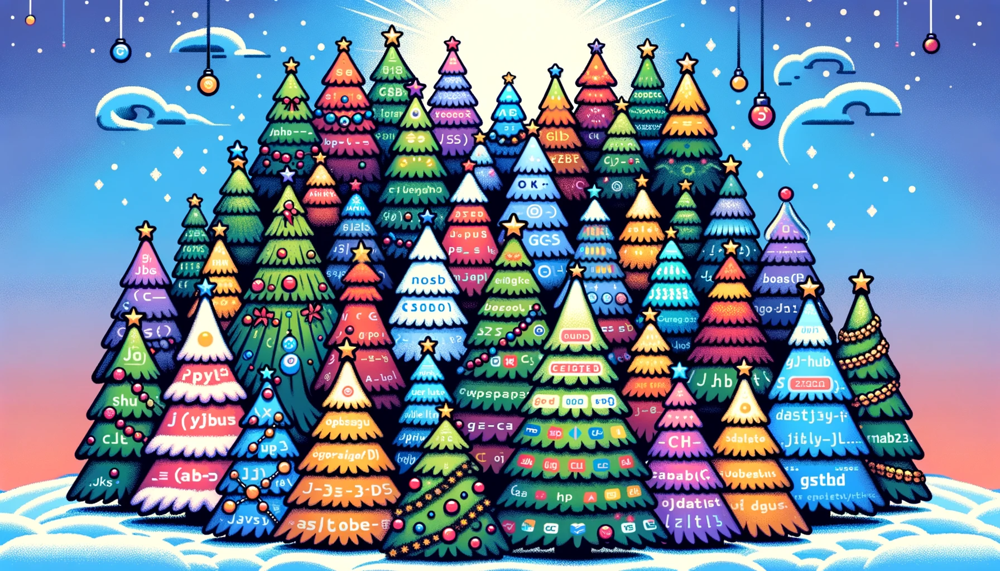

# 🎄🎅 DigitalChristmasTreeFarm (数字圣诞树农场) 🌟❄️

📜 Read in [English](README.md) | 中文 📜

## 欢迎来到 DigitalChristmasTreeFarm！🎉🎁
踏入代码的冬日仙境，这里的圣诞树🎄随着编程的喜悦而闪烁。这个仓库是创意的圣诞颂歌，是学习和分享季节精神的雪地。🌨️👨‍💻

## 🌟 我们的节日使命
我们用代码的枝叶装饰走廊——每一个函数调用都带来节日的欢乐。我们的使命是将欢乐与方法论结合，打造一个包裹着节日乐趣的学习机会的花环。🕯️📜

## 📚 如何戴上你的编程帽
加入我们的小精灵，贡献您自己的代码树或从节日森林中学习。在 DigitalChristmasTreeFarm，整个季节都是黑客马拉松！
1. **提交代码**：在槲寄生下提交您的代码树作为礼物。💝
2. **探索 & 学习**：乘坐雪橇穿过我们的代码森林，照亮您的技能。🛷✨

## 🔗 赠送代码的指南
为了保持我们的仓库充满欢乐和光明，请：
- 像写圣诞颂歌一样编写清晰、有注释的代码。📝🎶
- 在您的项目文件夹中包含一份指南，就像树顶的星星一样引导我们。🌟📖
- 用小铃铛的声音为灵感来源和分支向原创作者致谢。🔔👏

## 🤝 分享感激之情的温暖
衷心感谢所有的贡献者——你们是秘密的圣诞老人，让这个农场成为一个充满数字奇妙的魔法地方！🎅👩‍💻

## 📄 开源的礼物
用我们的 [MIT 许可证](./LICENSE) 分享代码的礼物。越多越快乐！📜🤗

## 🎨 节日树木画廊
欣赏由代码精心打造的闪烁树木——每一棵都是字节和装饰品的庆祝。

### 🎄🌟 Python 项目分级 🌟🎄
开始我们的 Python 编程雪橇之旅，每个级别都比前一个更闪耀，更欢快！

🌟 **小贴士**：点击项目名称 - 它们就像通往代码冬日仙境的秘密通道！

#### 🎁 01_基础 - “拆开基础的礼物”
开启你的 Python 之旅，带着一丝节日魔法✨！非常适合刚开始编程冒险的小精灵。

##### ❄️ [ASCII 圣诞树](python/01_Basic/AsciiChristmasTree)
与`Ascii圣诞树`一起步入代码的冬日仙境！这个欢乐的小脚本将把你的终端变成一个节日ASCII艺术展示🎨。运行脚本，让你的屏幕在节日精神中闪耀🎅🌨️。非常适合在壁炉旁的温馨编程之夜🔥，以最极客的方式传播圣诞欢乐！

##### 🧱🎄 [积木圣诞树](python/01_Basic/BrickChristmasTree)
用 `Brick Christmas Tree` 脚本打造你自己的数字圣诞乐趣！🏗️🌟 观看终端内积木般的节日欢乐一块一块堆叠，形成一棵迷人的树。非常适合喜欢像素完美和编译欢乐的节日程序员！运行脚本，让欢乐开始编译！🎁👩‍💻 适合想要块块积累节日精神的每一个人！

##### 🎄 [简单圣诞树](python/01_Basic/SimpleChristmasTree)
准备好随着这个迷人的圣诞树项目在代码中铃声响彻🎵！非常适合那些想要在Python中加入一丝节日欢乐🎉的人。这是编程小精灵🧝和圣诞老人小助手们的理想起点！

#### ⛄ 02_中级 - “铃铛响叮当”
通过这些更激动人心的项目构建技能雪人，比找到盒子里最后一根糖果棒还要有趣。

#### 🦌 03_高级 - “驯鹿游戏”
用这些高级项目提升你的 Python 技能到树梢。复杂的算法和精妙的代码结构？没问题！

#### 🌠 04_专家 - “圣诞老人的工作坊”
对于那些听到铃声并回应编码精通呼唤的人。专家级挑战，创新和照亮 Python 天空。

### 🎅💾 节日可执行程序 - "嗨-嗨-代码！"

跳出Python的边界，与我们特制的可执行圣诞树一起体验节日的乐趣。这些不是你平常的节日装饰——它们是二进制的节日精神芭蕾！

#### 🌲✨ [常青闪闪圣诞树](bin/EvergreenSparkyChristmasTree.exe) 🎁💫

欢迎来到`常青闪闪`的永恒荧光！这棵树不仅仅是闪烁；它辐射出圣诞节欢乐的真谛。抓住这个`.exe`，让你的桌面成为节日精神的灯塔！在[bin/EvergreenSparkyChristmasTree.exe](bin/EvergreenSparkyChristmasTree(常青闪闪圣诞树).exe)找到它。

#### 🔌🌟 [电路树之光圣诞树](bin/CircuitreeGlowChristmasTree.exe) 💡🎄

瞧`电路树之光`，在LED灯光的交响曲中，硅与金箔相遇。这不仅仅是一棵圣诞树；这是一棵具有科技转折的圣诞树！通过运行点亮你的假日。运行来自[bin/CircuitreeGlowChristmasTree.exe](bin/CircuitreeGlowChristmasTree(电路树之光圣诞树).exe)的光芒，为你的假期充电。

### 💻 HTML/CSS 云杉穿上节日盛装
精心制作并用 CSS 裹上霜雪，这棵树在冬日的冷字节中温暖地发光，真正体现了季节之美。

#### 🌟✨ [螺旋圣诞树](htmlCSS/SpiralChristmasTree/) - 旋转的节日奇观 🌀🎄
与`SpiralChristmasTree`一同跳入节日季！这个项目为传统的节日装饰带来了异想天开的转折。简单运行一下脚本，观看动态的节日灯光在你的屏幕上生动地跳动，为冬季增添一抹温暖和无穷的欢乐。🌠🎁 准备迎接在你的代码世界中闪烁的旋转圣诞树吧！

#### 🎄 [冬日仙境圣诞树](htmlCSS/WinterWonderlandChristmasTree/) ❄️
走进 `冬日仙境圣诞树` 的像素完美天堂！在这个宁静的场景中，雪花轻轻降落在数字化的冷杉上。这块充满节日气息的互动画布展示了一棵节日圣诞树，置身于平和的雪中。舒适地坐下，让这片冬日的幸福风景将您带入愉快的编码小憩中！❄️👨‍💻

#### 🌠 [流星圣诞树](htmlCSS/MeteorChristmasTree/)
与 `流星圣诞树` 一起感受宇宙的触摸！🎄💫 这个项目将节日季的奇迹与夜空中流星轨迹的令人敬畏的美丽相结合。非常适合那些希望在他们的节日庆典中增添天体扭曲的人。点击查看一个与众不同的圣诞树，每一颗星星都是一个梦想成真！

#### 🎄 [水晶球圣诞树](htmlCSS/CrystalBallChristmasTree/)
欣赏 `水晶球圣诞树`，一件数字杰作，以优雅和闪耀螺旋进入节日季节！🌟🔮 观赏这棵树上像圣诞夜晴朗星空中闪烁的星星一样的灿烂光芒。一个对节日传统的现代转折，完美适合那些热爱将技术与节日结合的人。点击探索一个每一盏灯都是奇迹之球的树！

#### 🌐 [雪球圣诞树](htmlCSS/CrystalBallChristmasTree/)
探索 `雪球圣诞树` 的奇妙，每一次点击都带来一场欢乐的雪花飞舞！🌨️🎄 一个节日珍宝，将节日的欢乐精髓封装在一个异想天开的冬日球中。导航去见证一个经典的节日魅力在数字时代的重新想象！

... 还有更多！
