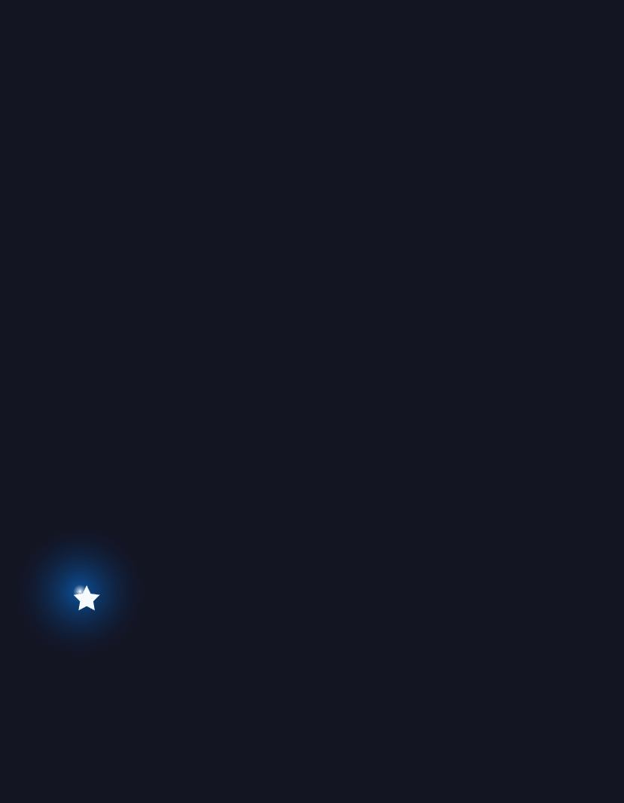

# 🌠 Meteor Christmas Tree 🎄✨

📜 Read in English | [中文](README.zh.md) 📜

## Overview
Welcome to the `Meteor Christmas Tree`, a stellar holiday spectacle that captures the beauty of a Christmas tree with the whimsical twist of a shooting star. 🌟 Glide into the festive season as this celestial pine illuminates the dark winter sky.

## Features
- A unique Christmas tree design that mirrors the swift journey of a meteor through the night. 🚀
- Sparkling animations that mimic the shimmering trail left by a star's graceful flight. 💫
- A joyful addition to your holiday coding projects, bringing a dash of cosmic cheer. 🌌

## Get Started
Clone the repository and launch the project to witness a galaxy of colors and lights decorating this unconventional Christmas tree. Perfect for those who dream of a white Christmas under the starlit sky!

## Animation effects

**May the `Meteor Christmas Tree` light up your holiday season with its astral glow! 🎅🔭**
