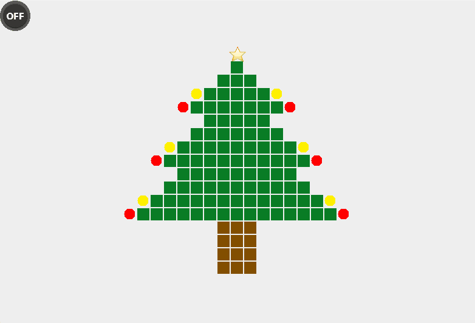

# 🎄 旋律圣诞树 🎤🎵

📜 Read in [English](README.md) | 中文 📜

**嗨皮圣诞！欢迎来到旋律圣诞树，这里圣诞欢乐的铃声与代码的节奏交织！🎹🎄**

## 介绍 🌟
撕开包装纸，瞧一瞧旋律圣诞树！这款 Java Swing 应用程序将把你带进桌面上的节日乐趣。伴随着像圣诞老人笑声一样愉快的曲调，还有随着节拍起舞的圣诞树，这个项目将带领你进入编程的冬日仙境！🎅💻

## 特色 🎁
- 动态圣诞树动画，照亮房间，点亮心情！🌲✨
- 欢快的圣诞颂歌让你边敲代码边轻拍脚尖！🎶👟
- 可定制设置就像你的节日饼干—撒上额外的闪光点！🍪✨
- 控件简单易用，就连鲁道夫用蹄子也能操作—音乐开关，只需轻点一下！🦌🎚️

## 如何运行 🏃‍♂️
像拉圣诞饼干一样克隆仓库，编译 Java 文件就像包装礼物一样简单，运行 `Main.java`—简单得就像派！（众所周知，圣诞老人超爱派！）🎁🥧

## 动画效果

## 节日快乐！🎉
愿你的代码无虫，假日光明。祝这个季节充满了平安、爱和动态数组—我是说，灯光阵列！🐞🔔
